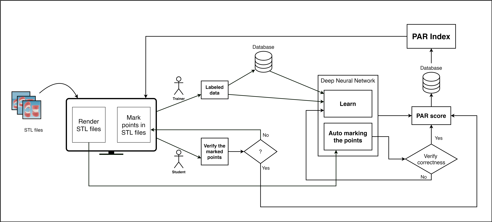
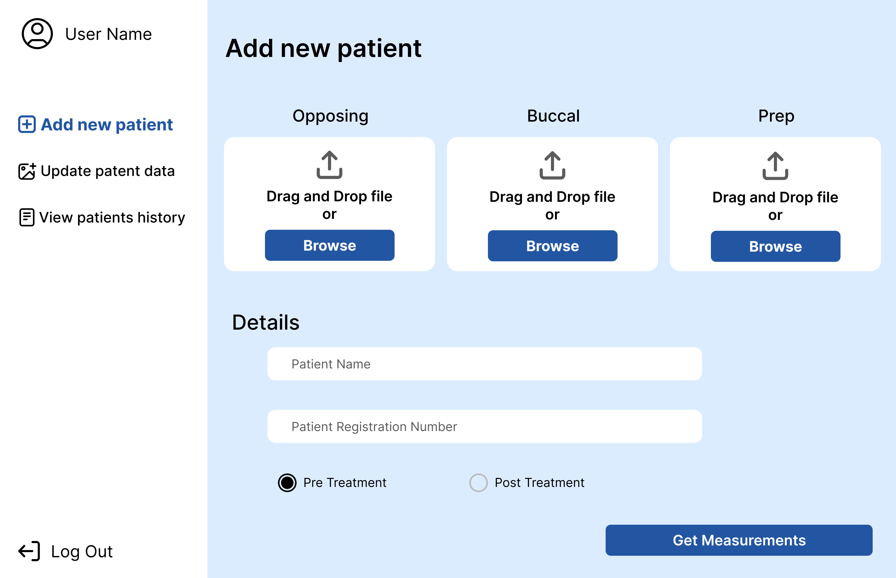

# Automated PAR Index Calculation on Orthodontic Treatment Using Software and Machine Learning Tools

#### Team

- E/18/154, Chamudi Jayasumana, [email](mailto:e18154@eng.pdn.ac.lk)
- E/18/349, Anushanga Pavith, [email](mailto:e18349@eng.pdn.ac.lk)
- E/18/327, Chamara Dilshan, [email](mailto:e18327@eng.pdn.ac.lk)

#### Supervisors

- Dr. Asitha Bandaranayake, [email](mailto:asithab@eng.pdn.ac.lk)
- Dr Kumari Ratnatilake, [email](mailto:ksandamala2002@dental.pdn.ac.lk)

#### Table of content

1. [Abstract](#abstract)
2. [Related works](#related-works)
3. [Methodology](#methodology)
4. [Experiment Setup and Implementation](#experiment-setup-and-implementation)
5. [Results and Analysis](#results-and-analysis)
6. [Publications](#publications)
7. [Links](#links)

---

## Abstract
Orthodontic treatment is essential for correcting misaligned and uneven teeth while contributing significantly to oral health and aesthetics. Traditional methods for evaluating orthodontic treatment success rely heavily on the manual examination of pre and post-treatment dental models, using indices like the Peer Assessment Rating (PAR) index. However, these methods suffer from subjectivity and variability, particularly among less experienced practitioners. This review of the literature looks into the creation and use of software tools intended to automate the evaluation of orthodontic treatment results using 3D models of orthodontic studies. Comparing manual and software-based evaluations highlights the potential of digital technologies to offer more objective, efficient, and accessible assessment methods. It explores the PAR index's role in treatment evaluation, the advantages of 3D visualization and analysis in orthodontics, existing digital tools in the field, and the statistical methods, use of machine learning in orthodontics and algorithms that underpin software evaluations. This exploration aims to demonstrate the benefits of software tools in enhancing treatment evaluation accuracy, improving learning for early-career orthodontists, and making standardized assessment methods more accessible to all practitioners.

## Related works
**PAR Index:** A key tool for evaluating orthodontic treatment outcomes, measuring deviations from ideal alignment and occlusion. Studies have validated its reliability and importance in orthodontic assessments, advocating for weighted scores to better reflect treatment improvements.

**3D Visualization and Analysis:** Advances in digital technology enable precise 3D modelling of dental structures, improving diagnosis, treatment planning, and outcome evaluation. Various studies emphasize the accuracy and reliability of 3D scans and the benefits of CAD software in orthodontics.

**Machine Learning in Orthodontics:** Machine learning applications are revolutionizing orthodontic diagnostics, treatment planning, and outcome evaluation by automating landmark identification, skeletal classification, and malocclusion diagnosis, among others. However, challenges such as data quality and model overfitting are noted.

**Software Tools Development:** The creation of digital tools like the Ortho Analyzer software and Dental Monitoring System demonstrates significant improvements in patient care, offering efficient, accurate, and patient-friendly orthodontic treatment evaluations. These tools leverage digital models and AI for better orthodontic practice management and treatment monitoring.

## Methodology
**System Data Flow**

## Experiment Setup and Implementation
**Objective**
The goal of this phase was to develop and implement a software solution that enables dentists and orthodontists to upload Stereolithography (STL) files, from which our software can extract measurements and automatically calculate the Peer Assessment Rating (PAR) index.

**Development**
The software was developed in stages, starting with the ability to render STL files. This functionality allowed users to visually analyze and mark anatomical points on the 3D model for measurement purposes. The marked data were then stored in a dedicated database for subsequent analysis.

**Data Collection**
An interface was created for users, primarily consisting of dental professionals and trainees, to interact with the STL files. As they marked the necessary points on the 3D models, these data points served as labelled data for training our deep neural network.

**Machine Learning Implementation**
A deep learning framework was chosen to develop a neural network capable of learning from the labelled dataset. The network was designed to:

1. Learn the patterns of point marking from the dataset.
2. Automate the marking process on new STL files without human intervention.
3. Calculate the PAR index based on the identified points.

**Verification Process**
The system includes a verification process where the automatically marked points and calculated PAR index are reviewed. This verification can be performed by:
1. Comparing the software’s output with manual markings and calculations.
2. Assessing the consistency and accuracy of the software across a variety of cases with known PAR indices.

**Testing and Validation**
The software underwent rigorous testing by having it process a diverse set of STL files marked by experienced orthodontic practitioners. The accuracy of the software's auto-marking and PAR calculation was then compared against the expert's markings.

**Iteration and Optimization**
Feedback from the testing phase led to iterative improvements in the deep learning model, refining its accuracy and reliability. The final implementation showed a high degree of concordance with expert assessments, confirming the model's efficacy.

**Implementation**
The finalized software was deployed on a web-based platform, allowing users to access the tool remotely. The platform features a user-friendly interface for uploading STL files, initiating the auto-marking process, and obtaining the PAR index results.

**UI/UX designs**

  
  &nbsp;
  
  &nbsp;
  
  &nbsp;
  
  &nbsp;
  
  &nbsp;
  
  &nbsp;

## Results and Analysis

## Publications
1. [Semester 7 report](https://docs.google.com/document/d/16jnZlhk0vevTFfMshj0TkNXyewa5vGLhrcHlM-IsdBY/edit?usp=sharing)
2. [Semester 7 slides](https://docs.google.com/presentation/d/15Y7DYUnLUMbanED_qUqEZDwQIxZtWAux/edit?usp=sharing&ouid=108090300417007817254&rtpof=true&sd=true)
<!-- 3. [Semester 8 report](./) -->
<!-- 4. [Semester 8 slides](./) -->
<!-- 5. Author 1, Author 2 and Author 3 "Research paper title" (2021). [PDF](./). -->

## Links
- [Project Repository](https://github.com/cepdnaclk/e18-4yp-Gamification-of-Orthodontic-Treatment-Success-with-Pre-and-Post-Dental-Models)
- [Project Page](https://cepdnaclk.github.io/e18-4yp-Gamification-of-Orthodontic-Treatment-Success-with-Pre-and-Post-Dental-Models/)
- [Department of Computer Engineering](http://www.ce.pdn.ac.lk/)
- [University of Peradeniya](https://eng.pdn.ac.lk/)
